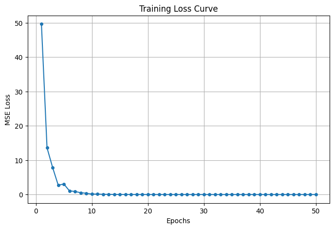

# GRAPH-BASED USER BEHAVIOR ANALYSIS AP-PROACH FOR ANOMALY DETECTION ON E-LEARNING PLATFORMS

## **Project Overview**  

This project is conducted as part of the **Graph Analytics** course and aims to analyze **user behavior** on **MOOCs platforms** such as **Coursera**. The primary objective is to track user activity and detect **patterns** to verify whether the registered user is the one actually interacting with the platform or if **fraudulent activities** (e.g., unauthorized users completing courses or earning certificates) are occurring.

To achieve this, we track actions such as **click events, session frequency, and course type**, and leverage **graph-based modeling** techniques, including **Graph Neural Networks (GNNs) and Autoencoders**, to detect complex behavioral patterns in the dataset.

---

## **Data Processing**  

**Notebooks:** *data_preprocessing.ipynb* and *preprocessing__with_pyspark.ipynb*   

The raw dataset contains multiple attributes, some of which are irrelevant to our study. Since our primary goal is **anomaly detection in user behavior**, we **excluded** attributes such as user demographic details (**gender, birth year, education**) since they are more relevant for tasks like **community detection** or **course recommendations**, rather than fraud detection. Additionally, we did not use **dropout labels** since our objective is **not dropout prediction**.

### **Preprocessing Steps**
To ensure data consistency and reliability, we applied the following preprocessing steps:

1. **Data Cleaning**:  
   - Removed unnecessary attributes.
   - Handled missing values.
   - Ensured session-based interactions remained **intact**.

2. **Feature Selection**:  
   - Retained only **essential attributes** related to user activity, session behaviors, and course interactions, aligning with our **graph-based modeling**.

3. **Dataset Integration**:  
   - Merged multiple datasets (**Dropout Prediction, User Profile, and Course Information**) into a single dataset that accurately represents meaningful **learning interactions**.

---

### **Feature Engineering & Featurization**  

To analyze **user behavior dynamics**, we engineered additional **engagement-based** features:

- **`session_duration`**: Total time a user spends within a session, measuring **engagement**.  
- **`session_gap`**: Time difference between **consecutive sessions**, analyzing **learning continuity**.  
- **`action_count`**: Number of interactions per session, representing **session intensity**.  
- **`action_frequency`**: Rate of user interactions per second, helping to **detect engagement variations**.  

These additional features help us track **behavioral anomalies** such as:  
- **Unusual session lengths** (e.g., a session lasting **hours** could indicate **automated activity**).  
- **Sudden drops in engagement** (e.g., long session gaps **without interactions**).  
- **Unrealistically high action frequencies**, which may suggest **bot-like behavior**.

The final **preprocessed dataset** contains the following attributes:

| **Attribute**        | **Description**  |
|----------------------|----------------|
| `username`          | Unique identifier for each user. |
| `enroll_id`        | Unique enrollment ID per user-course pair. |
| `session_id`        | Unique identifier for each session. |
| `course_id`         | Unique course identifier. |
| `action`            | Type of action performed (e.g., play video, seek video, click info, submit assignment). |
| `time`              | Timestamp of the action. |
| `category`          | Course category (e.g., Science, Business, Engineering). |
| `session_duration`  | Total time spent in a session. |
| `session_gap`       | Time difference between consecutive sessions of a user. |
| `action_count`      | Total number of actions performed in a session. |
| `action_frequency`  | Number of actions performed per second in a session. |

---

### **Dataset Reduction & Optimization**  

Due to the **large size of the dataset**, we faced **memory constraints**. To address this:
- We used **Apache Spark** and **Pyspark** to process and optimize the dataset efficiently.
- We **selected the top 2% most active users**, leading to the `top_02percent_most_sessions.csv` dataset.

This **optimized dataset** forms the **foundation** for our **graph-based modeling**.

---
## **Graph-Based Approaches**  

### **1. Session-Based Graph Modeling**  

**Notebook:** *Graph_construction_and_modeling_training.ipynb*

IN this approach  **each user session as a graph**, where:  

- **Nodes** represent individual user actions, enriched with contextual features.  
- **Edges** capture the **temporal and logical relationships** between actions.  
- **Global session attributes**, such as session duration and click patterns, are incorporated to enhance the model.

To process these session graphs, we implemented a **Graph Embedder** based on **GCN layers**, which generates **latent representations (embeddings)** for each session. These embeddings are then passed into a **Siamese network** that classifies user similarities, leveraging techniques such as:
- **Concatenation & absolute difference** of session embeddings.
- **Multi-layer classifier** with **ReLU activations** and **dropout** for robust generalization.
- **Pairwise classification** to differentiate between sessions from the same or different users.

This methodology allows us to **detect anomalous sessions** and **flag potential fraud cases**.

---

### **2. User-Based Graph Modeling (Autoencoder Approach)** 

**Notebook:** *User_based_modeling_Autoencoder.ipynb*  

An alternative approach considers **one graph per user** rather than per session. We selected the **top 20 most active users** and constructed **individual graphs** where:  
- **Nodes** represent **sessions, actions, and courses**.  
- **Edges** model **relationships** between these entities.  

We trained a **Graph Autoencoder (GAE)** to learn **compact latent representations** of user behaviors. The autoencoder consists of:  
1. **Encoder:** Compresses graph node features using **Graph Convolutional Networks (GCN)**.  
2. **Decoder:** Reconstructs the original features from the latent space.  
3. **MSE Loss Function:** Measures the reconstruction error to detect anomalies.  

Once trained, the model computes an **error threshold**. When a **new user logs in**, we compare their graph’s reconstruction error against the threshold to determine if:  
It is the **real** account owner.  
Someone else is **fraudulently accessing** the account.  

This method is particularly effective in **detecting irregular usage patterns**, as fraudsters often exhibit **different behavioral signatures** compared to genuine users.

---

## **Results & Findings**  
### **Graph Autoencoder Training Performance**
- The **Mean Squared Error (MSE)** loss steadily decreased over **50 epochs**, indicating the model successfully learned user behavior patterns.  
- The final loss value stabilized, suggesting the model reached a meaningful representation of user activities.  

### **Session-Based Modeling**
- Successfully **differentiated legitimate and suspicious sessions**.  

### **User-Based Autoencoder**
- Demonstrated effectiveness in **fraud detection** by identifying **unexpected user behavior**.
- Showed strong **generalization ability** by detecting deviations from learned patterns.

---

## **Loss Function - Mean Squared Error (MSE)** 

The **reconstruction error** is computed using the **Mean Squared Error (MSE) loss function**

The lower the MSE loss, the better the autoencoder has learned the user behavior. A **higher reconstruction error** suggests an **anomalous behavior**, indicating a potential fraudulent activity.

### **MSE Loss Curve**
Below is the **MSE loss curve** over the training epochs:

---

## **Conclusion**  

This project highlights the potential of **Graph Neural Networks (GNNs) and Autoencoders** in **user behavior analysis** and **fraud detection** on MOOCs platforms. By **modeling interactions as graphs**, we effectively identify **deviations from normal activity**, making these techniques **valuable tools for security and authentication** in **online learning platforms**.

---

## **Ongoing Research: User & Host Behavior Analysis in Cybersecurity**  

Our work extends beyond MOOCs fraud detection. We are currently working on a **larger project focused on user and host behavior analysis in cybersecurity**. This research aims to detect **anomalous activities in networks**, identify **potential threats**, and enhance **security mechanisms** using **graph-based AI models**.  
